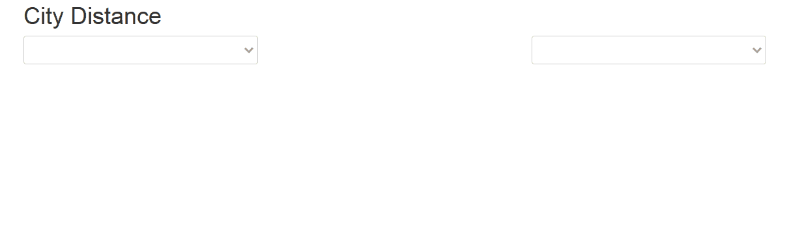

# eseoJavaEEWebProject

A simple JavaEE project I used to build a DevOps Environment using jenkins, sonarQube and tomcat.

This project fetch all french cities from the [official API](https://api.gouv.fr/api/api-geo.html) and deploy a webapp enabling the user to get the distance between two cities.

Aperçu : 

### Setup

To use this project, you need :
1. a tomcat server
2. a postgresql database with rw rights.

   the properties should be modified in src/main/resources/hibernate.cfg.xml to adapt url, user and password to your needs. 

### API description
* GET /

  webapp
* GET /api/communes
  
  params=name,limit
  
  get the communes listed in the database.

* POST /api/communes/update

  update the database. takes a good 30s though, don't do it lightly
  

### tech : 
* Back:

  JavaEE - Jersey - Hibernate
* Front:

  VueJS

